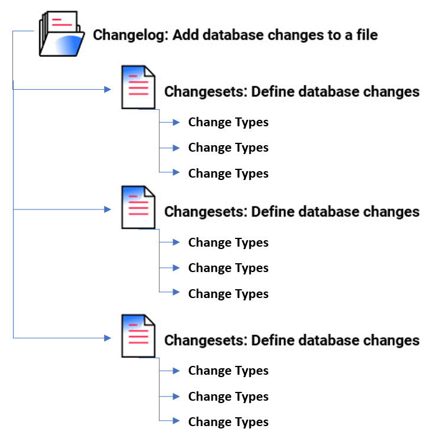
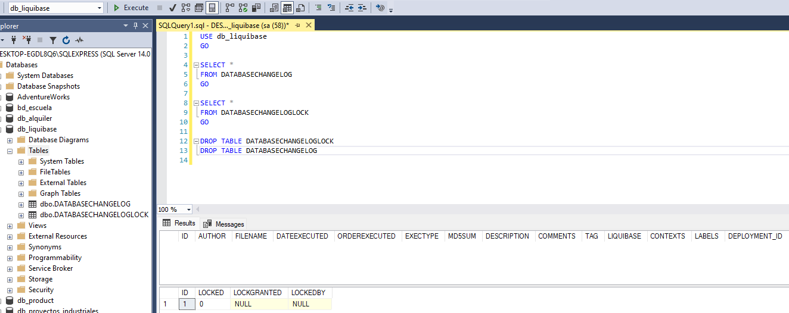
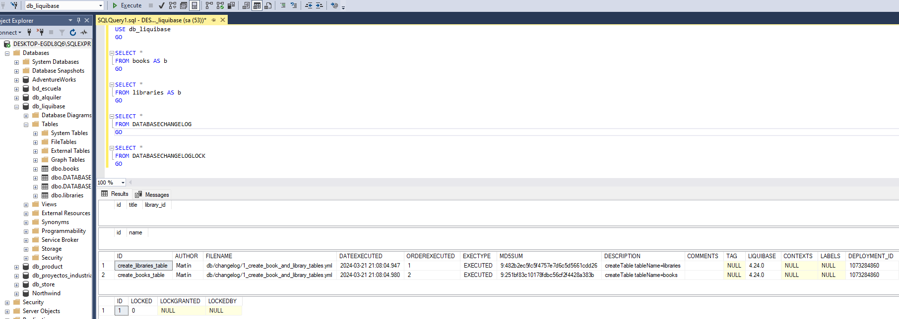
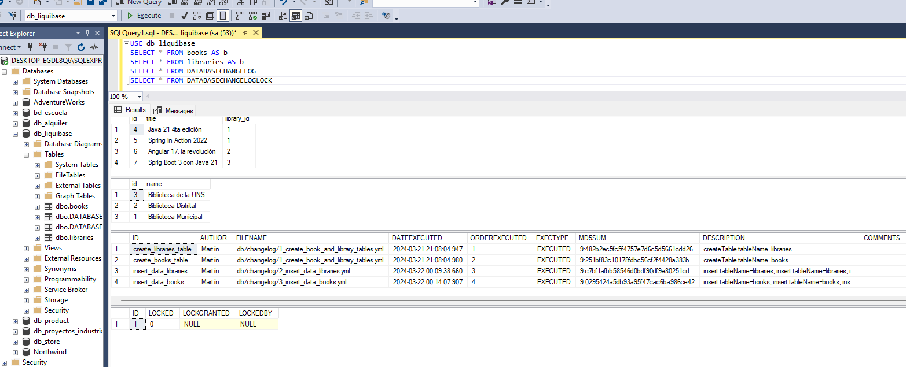
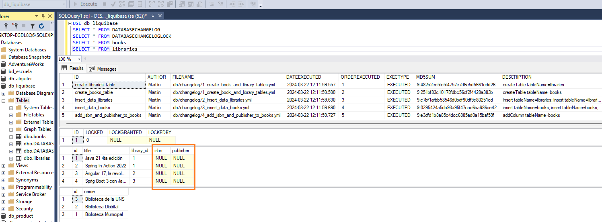

# [Versionado de base de datos con Liquibase](https://www.linkedin.com/pulse/java-database-versioning-liquibase-tiago-melo/)

- [Liquibase Documentation](https://docs.liquibase.com/home.html)

---

## Introducción a Liquibase

El control de versiones de los cambios en la base de datos es tan importante como el control de versiones del código
fuente. Al utilizar una herramienta de migración de bases de datos, podemos gestionar de forma segura cómo evoluciona la
base de datos, en lugar de ejecutar un montón de archivos SQL sueltos sin versiones.

`Liquibase` es una solución de gestión de cambios de esquema de base de datos que le permite revisar y publicar cambios
en la base de datos de forma más rápida y segura desde el desarrollo hasta la producción.

Para comenzar a utilizar Liquibase de forma rápida y sencilla, puede escribir sus scripts de migración en `SQL`.

**Para aprovechar las capacidades de abstracción de la base de datos que le permiten escribir cambios una vez e
implementarlos en diferentes plataformas de bases de datos, puede especificar cambios independientes de la base de
datos en** `XML`, `JSON` o `YAML`.

## Características de Liquibase

- Es independiente de la base de datos: funciona con todos los principales proveedores de bases de datos.
- Puede especificar sus cambios en formatos `XML`, `YAML`, `JSON` y `SQL`.

Usaremos el formato `YAML`

## [ChangeLog](https://docs.liquibase.com/concepts/changelogs/home.html)

Un archivo que realiza un seguimiento de todos los cambios que deben ejecutarse para actualizar la base de datos.

Con `Liquibase`, utiliza un archivo de registro de cambios `(changeLog)` basado en texto para enumerar secuencialmente
todos los cambios realizados en su base de datos. Este libro de contabilidad ayuda a Liquibase a auditar su base de
datos y ejecutar cualquier cambio que aún no se haya aplicado. Puede almacenar y versionar su registro de cambios en
cualquier herramienta de control de fuente.

Una **unidad de cambio individual** en su `changeLog` se llama `changeSet`. Cuando desee modificar su base
de datos, simplemente agregue un nuevo `changeSet` y especifique su operación como un `change Type`. Por ejemplo,
puede agregar un `changeSet` para crear una nueva tabla y otro `changeSet` para eliminar una clave
principal.

## [ChangeSet](https://docs.liquibase.com/concepts/changelogs/changeset.html)

Son cambios atómicos que se aplicarían a la base de datos. Cada `changeSet` se identifica de forma única
mediante `id` y `autor`. Cada `changeSet` se ejecuta como una `única transacción`.

Un `changeSet` es la unidad básica de cambio en Liquibase. Almacena todos sus conjuntos de cambios en su
registro de cambios. Sus `changeSet` contienen `changeTypes` que especifican qué hace cada cambio, como
crear una nueva tabla o agregar una columna a una tabla existente.

Un `changeSet` está etiquetado de forma única por los atributos de `autor` e `id` (autor:id), así como
por la ruta del archivo de registro de cambios. La etiqueta `id` es solo un identificador: **no dirige el
orden en que se ejecutan los cambios y no tiene que ser un número entero.** Para implementar el conjunto de cambios con
el comando de `update`, debe incluir tanto el `autor` como el `id`. Puede especificar `Preconditions`,
`Contexts`, `Labels` y otros atributos en conjuntos de cambios individuales para controlar exactamente cuándo se
ejecutan.

**Es una buena práctica especificar solo un `changeType` por `changeSet`.** Al hacerlo, se evitan sentencias de
confirmación automática fallidas que pueden dejar la base de datos en un estado inesperado. Cuando implementas tus
cambios, cada `changeSet` tiene éxito o falla; si falla, puede corregirlo y volver a implementarlo. También
puede agregar comentarios a conjuntos de cambios individuales para explicar por qué son importantes.

## [Change Types](https://docs.liquibase.com/change-types/home.html)

Un `Change Type` es un cambio con formato `XML`, `YAML` o `JSON` independiente de la base de datos que puede especificar
para actualizar su base de datos con Liquibase. Los `Change Types` corresponden a declaraciones `SQL` aplicadas a su
base de datos, como `CREATE TABLE`. Usted especifica el `Change Type` que desea utilizar dentro de un `ChangeSet`
en su `ChangeLog`.

> Se recomienda incluir solo un `Change Type` por `ChangeSet`. Al hacerlo, se evitan
> sentencias de confirmación automática fallidas que pueden dejar la base de datos en un estado inesperado.

## Organización de ChangeLog

Liquibase utiliza archivos de registro de cambios `SQL`, `XML`, `JSON` y `YAML` para enumerar los cambios de la base de
datos en orden secuencial. Los cambios de la base de datos tienen el formato de `changeSets`. Los `changeSets`
contienen `changeType`, que **son tipos de operaciones que se aplican a la base de datos, como agregar una columna o
una clave principal.** Las etiquetas de registro de cambios de contexto, etiquetas y condiciones previas ayudan a
controlar con precisión cuándo se realiza un cambio en la base de datos y en qué entorno de base de datos se implementa.



## Database Changelog y Database Changelog Lock

Cuando implementa sus cambios, Liquibase crea dos tablas en su base de datos: `DATABASECHANGELOG`
y `DATABASECHANGELOGLOCK`.

`DATABASECHANGELOG` realiza un seguimiento de los cambios implementados para que tenga un registro. Liquibase compara
los `changeSets` en el archivo de registro de cambios `(changeLog)` con la tabla de seguimiento `DATABASECHANGELOG` e
implementa solo los `changeSets` nuevos.

`DATABASECHANGELOGLOCK` evita que varias instancias de Liquibase actualicen la base de datos al mismo tiempo. La tabla
administra el acceso a la tabla `DATABASECHANGELOG` durante la implementación y garantiza que solo una instancia de
Liquibase actualice la base de datos.

---

# [Usando Liquibase con Spring Boot](https://contribute.liquibase.com/extensions-integrations/directory/integration-docs/springboot/springboot/)

---

## Dependencias

````xml
<!--Spring Boot 3.2.4-->
<!--Java 21-->
<dependencies>
    <dependency>
        <groupId>org.springframework.boot</groupId>
        <artifactId>spring-boot-starter-data-jpa</artifactId>
    </dependency>
    <dependency>
        <groupId>org.springframework.boot</groupId>
        <artifactId>spring-boot-starter-web</artifactId>
    </dependency>
    <dependency>
        <groupId>org.liquibase</groupId>
        <artifactId>liquibase-core</artifactId>
    </dependency>

    <dependency>
        <groupId>com.microsoft.sqlserver</groupId>
        <artifactId>mssql-jdbc</artifactId>
        <scope>runtime</scope>
    </dependency>
    <dependency>
        <groupId>org.projectlombok</groupId>
        <artifactId>lombok</artifactId>
        <optional>true</optional>
    </dependency>
    <dependency>
        <groupId>org.springframework.boot</groupId>
        <artifactId>spring-boot-starter-test</artifactId>
        <scope>test</scope>
    </dependency>
</dependencies>
````

Al crear el proyecto desde `Spring Initializr` y agregar la dependencia de `Liquibase`, se nos crea en automático el
directorio `src/main/resources/db/changelog`.

## Application.yml

````yml
server:
  port: 8080
  error:
    include-message: always

spring:
  application:
    name: spring-boot-liquibase

  datasource:
    url: jdbc:sqlserver://localhost:1433;databaseName=db_liquibase;encrypt=true;trustServerCertificate=true;
    username: sa
    password: magadiflo

  jpa:
    properties:
      hibernate:
        format_sql: true

  liquibase:
    change-log: classpath:db/changelog-master.yml

logging:
  level:
    org.hibernate.SQL: DEBUG
    org.hibernate.orm.jdbc.bind: TRACE
````

**NOTA**

- Por defecto, se espera que el archivo changeLog de Liquibase esté en `db/changelog/changelog-master.yml`; pero estamos
  cambiando el valor de la configuración `spring.liquibase.change-log` para ponerlo en
  `src/main/resources/db/changelog-master.yml`.

## Configurando el changelog-master.yml

Recordemos que Liquibase nos permite trabajar con distintos tipos de archivos SQL, XML, JSON y `YML`. En este proyecto
trabajaremos con `YML`, es por eso que creamos el archivo `changelog-master.yml`.

Agregamos el siguiente contenido a dicho archivo:

````yaml
databaseChangeLog:
````

La configuración `databaseChangeLog` es el punto de partida a partir del cual se agregan los `changeSets`,
pero por el momento, como queremos ejecutar la aplicación, solo dejaremos dicha configuración, ya que el
archivo  `changelog-master.yml` no puede estar vacío, sino nos va a mostrar un error.

## Ejecutando aplicación

Si hasta este punto ejecutamos la aplicación, veremos que todo se ejecutará exitosamente y si revisamos la base de datos
veremos que se nos han creado dos tablas:



## Creando entidades, repositorios y controladores

Iniciaremos con unas clases base, digamos que son los primeros requerimientos que tenemos, así que debemos crear las
entidades, repositorios, controladores, etc. Más adelante, veremos cómo podemos cambiar esta estructura base, sobre todo
en las entidades, cuando nos llegue un requerimiento de que la entidad `Book` requiere un nuevo campo o la
entidad `Library` requiere otro campo, etc. Veremos cómo es que con la ayuda de las migraciones que hace
`Liquibase` todo nos resultará sencillo.

## Entidades

````java

@NoArgsConstructor
@AllArgsConstructor
@Builder
@Data
@Entity
@Table(name = "books")
public class Book {
    @Id
    @GeneratedValue(strategy = GenerationType.IDENTITY)
    private Long id;

    @Column(nullable = false)
    private String title;

    @ManyToOne
    @JoinColumn(name = "library_id")
    private Library library;
}
````

````java

@NoArgsConstructor
@AllArgsConstructor
@Builder
@Data
@Entity
@Table(name = "libraries")
public class Library {
    @Id
    @GeneratedValue(strategy = GenerationType.IDENTITY)
    private Long id;

    @Column(nullable = false)
    private String name;

    @JsonIgnore
    @OneToMany(mappedBy = "library")
    private List<Book> books = new ArrayList<>();
}
````

## Repositorios

````java
public interface BookRepository extends CrudRepository<Book, Long> {
}

public interface LibraryRepository extends CrudRepository<Library, Long> {
}
````

## Controladores

Aquí nos estamos saltando la creación de los `services`, dado que este proyecto está enfocado en el uso de `Liquibase`,
vamos a omitir esa capa para hacer más sencilla la aplicación.

````java

@RequiredArgsConstructor
@Slf4j
@RestController
@RequestMapping(path = "/api/v1/books")
public class BookController {

    private final BookRepository bookRepository;

    @GetMapping
    public ResponseEntity<List<Book>> getAllBooks() {
        return ResponseEntity.ok((List<Book>) this.bookRepository.findAll());
    }

    @PostMapping
    public ResponseEntity<Book> saveBook(@RequestBody Book book) {
        Book bookDB = this.bookRepository.save(book);
        return new ResponseEntity<>(bookDB, HttpStatus.CREATED);
    }
}
````

````java

@RequiredArgsConstructor
@Slf4j
@RestController
@RequestMapping(path = "/api/v1/libraries")
public class LibraryController {

    private final LibraryRepository libraryRepository;

    @GetMapping
    public ResponseEntity<List<Library>> getAllLibraries() {
        return ResponseEntity.ok((List<Library>) this.libraryRepository.findAll());
    }

    @PostMapping
    public ResponseEntity<Library> saveLibrary(@RequestBody Library library) {
        Library libraryDB = this.libraryRepository.save(library);
        return new ResponseEntity<>(libraryDB, HttpStatus.CREATED);
    }
}
````

## Ejecutando la aplicación

Si hasta este punto ejecutamos la aplicación, veremos que no hay tablas creadas en la base de datos y eso es, porque
no le hemos dicho a `hibernate` que nos cree las tablas a partir de las entidades como normalmente lo hemos venido
haciendo y eso está bien, ya que ahora crearemos dichas tablas utilizando `Liquibase`.

## Organizando nuestros changeLogs (archivos de migración)

El directorio `/changelog` será usado para colocar todos los archivos de migración que iremos creando conforme avance
el proyecto.

Solo para mantener una regla general propia, es que adoptaremos la siguiente nomenclatura para los archivos de
migración:

> <migration_number>_<what_does_this_migration_do>.yml

Ahora, el archivo `changelog-master.yml`, es el archivo que definimos en la propiedad `spring.liquibase.change-log`
del `application.yml`, por lo tanto, será el archivo donde incluiremos todas las migraciones que vayamos creando.

Por ejemplo, en nuestro archivo `changelog-master.yml` podemos incluir archivo por archivo:

````yml
databaseChangeLog:
  - include:
      file: /db/changelog/1_create_book_and_library_tables.yml
````

O como en nuestro caso, incluiremos todo el directorio `/db/changelog`:

````yml
databaseChangeLog:
  - includeAll:
      path: /db/changelog/
````

## ChangeLog #1: Creación de tablas

De esta forma, `Liquibase` ejecutará los `changeLogs` ordenados por su número.

Este es nuestro archivo `1_create_book_and_library_tables.yml`. Como su nombre lo indica, crea las tablas:

````yml
databaseChangeLog:
  - changeSet:
      id: create_libraries_table
      author: Martín
      changes:
        - createTable:
            tableName: libraries
            columns:
              - column:
                  name: id
                  type: BIGINT
                  autoIncrement: true
                  constraints:
                    primaryKey: true
              - column:
                  name: name
                  type: VARCHAR(255)
                  constraints:
                    nullable: false
                    unique: true
  - changeSet:
      id: create_books_table
      author: Martín
      changes:
        - createTable:
            tableName: books
            columns:
              - column:
                  name: id
                  type: BIGINT
                  autoIncrement: true
                  constraints:
                    primaryKey: true
              - column:
                  name: title
                  type: VARCHAR(255)
                  constraints:
                    nullable: false
                    unique: true
              - column:
                  name: library_id
                  type: BIGINT
                  constraints:
                    foreignKeyName: fk_libraries_books
                    references: libraries(id)
````

## Ejecutando aplicación

Al ejecutar la aplicación con el `changeLog` anterior, observamos que en la base de datos se han creado las dos tablas
definidas: `libraries` y `books`, además la tabla `DATABASECHANGELOG` empieza a registrar qué migraciones se están
ejecutando para llevar el control de los mismos:



Podemos realizar peticiones a nuestro backend y ver que se realiza sin ningún problema, eso significa que la
comunicación con la base de datos está funcionando correctamente:

````bash
$ curl -v http://localhost:8080/api/v1/books | jq

>
< HTTP/1.1 200
<
[]
````

````bash
$ curl -v http://localhost:8080/api/v1/libraries | jq

>
< HTTP/1.1 200
<
[]
````

## Changelog #2 and #3: inicializando datos

Veamos cómo podemos inicializar nuestras tablas.

Primero crearemos el archivo `2_insert_data_libraries.yml`, ya que esta tabla no depende de nadie, es una tabla
principal:

````yml
databaseChangeLog:
  - changeSet:
      id: insert_data_libraries
      author: Martín
      changes:
        - insert:
            tableName: libraries
            columns:
              - column:
                  name: name
                  value: Biblioteca Municipal
        - insert:
            tableName: libraries
            columns:
              - column:
                  name: name
                  value: Biblioteca Distrital
        - insert:
            tableName: libraries
            columns:
              - column:
                  name: name
                  value: Biblioteca de la UNS
````

A continuación creamos el archivo `3_insert_data_books.yml` que será para definir los registros de la tabla `books`.
Este archivo lo creamos segundo, ya que la tabla `books` tiene la clave foránea de la tabla `libraries`, es decir,
los registros de `books` dependen de los registros de la tabla `libraries`:

````yml
databaseChangeLog:
  - changeSet:
      id: insert_data_books
      author: Martín
      changes:
        - insert:
            tableName: books
            columns:
              - column:
                  name: title
                  value: Java 21 4ta edición
              - column:
                  name: library_id
                  valueNumeric: 1
        - insert:
            tableName: books
            columns:
              - column:
                  name: title
                  value: Spring In Action 2022
              - column:
                  name: library_id
                  valueNumeric: 1
        - insert:
            tableName: books
            columns:
              - column:
                  name: title
                  value: Angular 17, la revolución
              - column:
                  name: library_id
                  valueNumeric: 2
        - insert:
            tableName: books
            columns:
              - column:
                  name: title
                  value: Sprig Boot 3 con Java 21
              - column:
                  name: library_id
                  valueNumeric: 3
````

Ahora, ejecutamos la aplicación y revisamos lo que se generó en la base de datos:



Los registros fueron insertados en su correspondiente tabla y además guardan relación. Por otro lado, la
tabla `DATABASECHANGELOG` volvió a registrar datos, esta vez incluyó las dos migraciones para insertar datos.

Esta vez probamos los endpoints y vemos el siguiente resultado:

````bash
$ curl -v http://localhost:8080/api/v1/libraries | jq

>
< HTTP/1.1 200
<
[
  {
    "id": 3,
    "name": "Biblioteca de la UNS"
  },
  {
    "id": 2,
    "name": "Biblioteca Distrital"
  },
  {
    "id": 1,
    "name": "Biblioteca Municipal"
  }
]
````

````bash
$ curl -v http://localhost:8080/api/v1/books | jq

>
< HTTP/1.1 200
<
[
  {
    "id": 4,
    "title": "Java 21 4ta edición",
    "library": {
      "id": 1,
      "name": "Biblioteca Municipal"
    }
  },
  {
    "id": 5,
    "title": "Spring In Action 2022",
    "library": {
      "id": 1,
      "name": "Biblioteca Municipal"
    }
  },
  {
    "id": 6,
    "title": "Angular 17, la revolución",
    "library": {
      "id": 2,
      "name": "Biblioteca Distrital"
    }
  },
  {
    "id": 7,
    "title": "Sprig Boot 3 con Java 21",
    "library": {
      "id": 3,
      "name": "Biblioteca de la UNS"
    }
  }
]
````

**NOTA**

El id de `books` empieza en 4 y es porque había iniciado anteriormente la aplicación con errores, lo que ha provocado
que el id de la tabla `books` se incremente.

## Changelog #4: agregando columnas

Supongamos que durante el desarrollo del proyecto, consideramos necesario agregar los campos `isbn` y `publisher` a
nuestra tabla `books`.

### Primer paso

Crearemos el archivo de cambio (changeLog) llamado `4_add_isbn_and_publisher_to_books.yml` donde agregaremos las dos
columnas antes mencionadas:

````yml
databaseChangeLog:
  - changeSet:
      id: add_isbn_and_publisher_to_books
      author: Martín
      changes:
        - addColumn:
            tableName: books
            columns:
              - column:
                  name: isbn
                  type: VARCHAR(255)
                  constraints:
                    nullable: true
              - column:
                  name: publisher
                  type: VARCHAR(255)
                  constraints:
                    nullable: true
````

**NOTA**

> Estamos creando las nuevas columnas que aceptan `nulos`, esto es porque en la base de datos tenemos registros y si
> colocamos de antemano que las nuevas columnas `no acepten nulos` nos va a mostrar un error. Para hacer el ejemplo
> sencillo colocaremos que las nuevas columnas acepten `nulos`.
>
> Ahora, si necesitamos que las nuevas columnas sean `no-null` deberíamos luego hacer la modificación, pero en nuestro
> caso solo lo dejaremos como `null`.

Si ejecutamos la aplicación veremos que las columnas se han creado correctamente:



### Segundo paso

El segundo paso sería cambiar nuestra entidad `Book` para agregar estos dos nuevos campos:

````java

@NoArgsConstructor
@AllArgsConstructor
@Builder
@Data
@Entity
@Table(name = "books")
public class Book {
    @Id
    @GeneratedValue(strategy = GenerationType.IDENTITY)
    private Long id;

    @Column(nullable = false)
    private String title;

    private String isbn;        //<--- Nueva columna
    private String publisher;   //<--- Nueva columna

    @ManyToOne
    @JoinColumn(name = "library_id")
    private Library library;
}
````

Si ejecutamos la aplicación y hacemos una petición vía curl veremos que ya nos está retornando las nuevas columnas,
aunque como no tenemos registros insertados en ellas, es que vemos que nos retorna `null`:

````bash
$ curl -v http://localhost:8080/api/v1/books | jq

>
< HTTP/1.1 200
[
  {
    "id": 1,
    "title": "Java 21 4ta edición",
    "isbn": null,
    "publisher": null,
    "library": {
      "id": 1,
      "name": "Biblioteca Municipal"
    }
  },
  {...},
  {...},
  {
    "id": 4,
    "title": "Sprig Boot 3 con Java 21",
    "isbn": null,
    "publisher": null,
    "library": {
      "id": 3,
      "name": "Biblioteca de la UNS"
    }
  }
]
````
